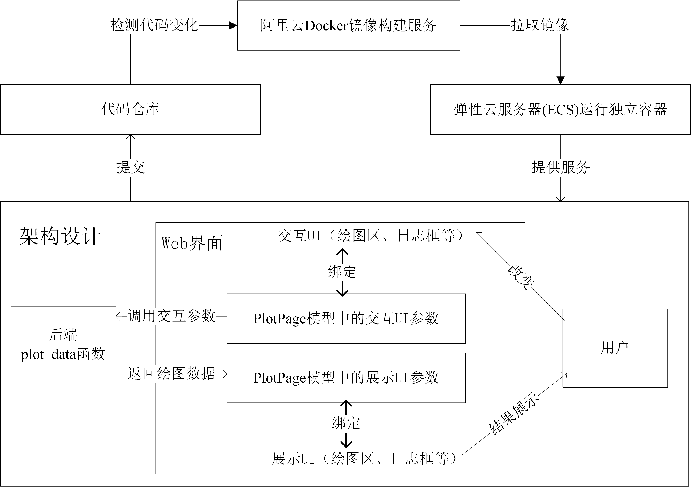

# PlotApp——图形绘制云应用

!!! tip
    参赛者: 杨景懿

    学校：西安交通大学

    专业：动力工程

    电话：15802956792

    QQ：522432938

    报名题目：软件题目5——图形绘制（同时集成软件题目2——交会图绘制）

!!! note

    云应用测试地址：[http://121.40.92.145:8080/](http://121.40.92.145:8080/)。推荐使用Chrome浏览器或Edge浏览器。
    PS: 打开后需要10s左右的渲染时间。

    **操作演示见Gif动图**

## 1 软件简介

PlotApp是基于云服务的图形绘制软件。采用客户端-服务端模式。其特点是:

* 用户界面(UI)使用Web浏览器
* 全栈开发使用Julia编程语言以及Julia生态中的相关库
* 云端使用Docker独立容器提供服务。


## 2 设计要素与功能实现

软件的核心要素如图所示：

  

* 测试地址——云服务器地址，端口8080
* 图标——中国石油测井Log
* 页面标题——2022中国石油集团测井有限公司校园创意大赛——图形绘制APP
* 删除数据按钮——删除已上传数据
* 文件上传UI组件——浏览本地文件夹并上传文件
* 日志UI组件——显示操作状态
* 绘图模式选择UI组件——选择绘图模式（题目5或题目2中的图形）
* 数据区间选择UI组件——选择数据区间（两端可调）
* 散点图形状选择UI组件——选择交会图散点形状，6个可选项。
* 交会图绘制区UI组件——绘制交会图（题目2），功能有：
  * Download png——当前状态截图
  * Zoom——放大选中区域
  * Pan——拖动图形视窗（滚动条）
  * Box Select——用方形框标记散点
  * Lasso Select——任意形状标记散点
  * Zoom in——整体放大绘图区
  * Zoom out——整体缩小绘图区
  * Autoscale——设置合适坐标轴范围
  * Reset axes——重置坐标轴范围
  * 读取任意个文件夹中的一位曲线（曲线名为文件名）
  * 自动识别一个文件中的多条曲线（奇数列为x，偶数列为y）
  * xy轴名称为第一条曲线的xy列名
* 组合图绘制区UI组件——绘制组合图（题目5），功能有：
  * Download png——当前状态截图
  * Zoom——放大选中区域
  * Pan——拖动图形视窗（滚动条）
  * Zoom in——整体放大绘图区
  * Zoom out——整体缩小绘图区
  * Autoscale——设置合适坐标轴范围
  * Reset axes——重置坐标轴范围

## 3 操作方法

可绘制两种图——交会图（题目2）与组合图（题目5）

### 3.1 交会图绘图

见文件夹演示Gif文件，步骤：

1. 先删除数据，确保无历史数据干扰
2. 上传交会图绘图数据
3. 选择绘图模式，交会图（CrossPlot）
4. 选择数据范围（选择绘图数据百分比，两端可调），数据越多，绘图时间越长。数据太大，云端可能出现内存溢出现象，即没有反应。（2核2G服务器，内存小）
5. 选择散点图形状
6. 点击绘图
7. 在交会图绘图区进行相关读图操作
8. 删除数据

### 3.2 组合图绘图

见文件夹演示Gif文件，步骤：

1. 先删除数据，确保无历史数据干扰
2. 上传组合图绘图数据（只接受2个文件，否则报错）
3. 选择绘图模式，组合图（Heatmap）
4. 选择数据范围（选择绘图数据百分比，两端可调），数据越多，绘图时间越长。数据太大，云端可能出现内存溢出现象，即没有反应。（2核2G服务器，内存小）
5. 点击绘图
6. 在组合图绘图区进行相关读图操作
7. 删除数据

!!! tip
    选择不同散点形状时，点击绘制图像按钮则进行更新。任意时刻点击绘制图像按钮都会对图像进行刷新。

    日志包含时间戳与信息，每次操作，时间戳会改变。

## 4 软件解析

### 4.1 文件结构

```powershell
PlotApp/
├── lib/             
│   ├── Data_Upload/ # 储存上传数据文件夹
│   ├── init.jl      # 初始化设定服务选项
│   ├── model.jl     # 储存UI页面交互变量
│   ├── PlotApp.jl   # App设计主页面
│   ├── support.jl   # 储存绘图支持函数，生成绘图数据与绘图布局
│   ├── types.jl     # 定义绘图布局属性，常量
│   └── ui.jl        # 储存UI页面布局函数
├── public/          # 储存中国石油图标
│   └── favicon.ico
├── test/            # 相关功能测试
│   └── ...
├── Dockerfile       # Docker镜像配置文件
├── Project.toml     # Julia环境配置文件
└── run.jl           # 软件启动入口
```

### 4.2 整体架构

  

### 4.3 依赖包

运行环境：Julia **v1.7 及以上**

在`Project.toml`文件中已配置

| 依赖包           |   版本要求   |
| ---------------- | :----------: |
| CSV.jl           |      /       |
| DataFrames.jl    |      /       |
| Genie.jl         | v4.0 及以上  |
| Revise.jl        |      /       |
| Stipple.jl       | v0.23 及以上 |
| StipplePlotly.jl | v0.12 及以上 |
| StippleUI.jl     | v0.18 及以上 |
| Tables.jl        |      /       |

### 4.4 API

仅包含核心API，更多见代码中函数及注释

| 所在文件           |         名称          |  类型  | 功能                                                               |
| -------------- | :-------------------: | :----: | ------------------------------------------------------------------ |
| lib/init.jl    | `create_storage_dir`  |  函数  | 创建数据文件夹                                                     |
| lib/model.jl   |      `PlotPage`       | 结构体 | 页面模型，储存UI交互变量                                           |
| lib/support.jl |      `plot_data`      |  函数  | 调用子函数（`read_CrossPlot_data`等）进行绘图 |
| lib/support.jl | `read_CrossPlot_data` |  函数  | 读取CSV文件内容，生成交互图绘图数据                             |
| lib/support.jl | `read_CrossPlot_Layout` |  函数  | 生成交互图布局数据                              |
| lib/support.jl | `read_Heatmap_data` |  函数  | 读取CSV文件内容，生成组合绘图数据                              |
| lib/support.jl | `read_Heatmap_Layout` |  函数  | 生成组合图绘布局数据                             |
| lib/ui.jl      |         `ui`          |  函数  | 创建Web页面。包含页面布局，交互变量监听                        |

## 5 运行方法

### 5.1 云端运行

云应用测试地址：[http://121.40.92.145:8080/](http://121.40.92.145:8080/)。推荐使用Chrome浏览器或Edge浏览器。

PS: 打开后需要10s左右的渲染时间。

### 5.2 本地运行

#### 方法一：本地运行run.jl

* Step1: 安装Julia
* Step2: 使用CMD终端切换到项目文件夹(run.jl所在文件夹)
* Step3: 在CMD终端输入下面代码

```cmd
julia .\run.jl
```

#### 方法二：本地docker容器

* Step1: 安装Docker Desktop
* Step2: 拉取镜像，cmd终端中输入：
```
docker pull registry.cn-hangzhou.aliyuncs.com/ai4energy/plotapp:local
```
* Step3: 在Docker Desktop运行镜像。

  

### 5.3 部署方式

* Step1: 安装docker
* Step2: **修改`run.jl`中`SERVEURL`地址，改成对应服务器地址。**
* Step3: 上传文件至服务器
* Step4: 构建镜像，示例
```powershell
docker build -t plotapp:1.5 .
```
* Step5: 使用docker run生成容器并运行。示例（其中容器卷地址需要适配对应服务器地址）：
```powershell
docker run -d -p 8080:8000 --name plotappp 
-v /home/plotapp/upload:/home/genie/app/lib/Data_Upload plotapp:1.5
```
